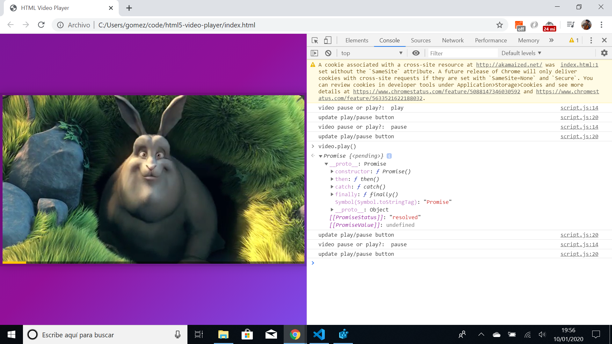

# :zap: Javascript HTML5 Video Player

* Wes Bos Youtube Tutorial: [Custom HTML5 Video Player - #JavaScript30 11/30](https://www.youtube.com/watch?v=yx-HYerClEA).
* **Note:** to open web links in a new window use: _ctrl+click on link_


## :page_facing_up: Table of contents

* [:zap: Javascript HTML5 Video Player](#zap-javascript-html5-video-player)
  * [:page_facing_up: Table of contents](#page_facing_up-table-of-contents)
  * [:books: General info](#books-general-info)
  * [:camera: Screenshots](#camera-screenshots)
  * [:signal_strength: Technologies](#signal_strength-technologies)
  * [:floppy_disk: Setup](#floppy_disk-setup)
  * [:computer: Code Examples](#computer-code-examples)
  * [:cool: Features](#cool-features)
  * [:clipboard: Status & To-Do List](#clipboard-status--to-do-list)
  * [:clap: Inspiration](#clap-inspiration)
  * [:file_folder: License](#file_folder-license)
  * [:envelope: Contact](#envelope-contact)

## :books: General info

* Tutorial Code to play video in HTML.

## :camera: Screenshots

.

## :signal_strength: Technologies

* Ran in Google Chrome browser with: [Javascript engine V8 9.9 for Windows (x64)](https://v8.dev/).

## :floppy_disk: Setup

* Open index.html in browser. If any code is changed the browser needs to be refreshed.

## :computer: Code Examples

* function to show play or pause button.

```javascript
function updateButton() {
  console.log('update play/pause button');
  const icon = this.paused? '►' : '❚ ❚';
  toggle.textContent = icon;
}
```

## :cool: Features

* Controls for video volume and play-back speed.

## :clipboard: Status & To-Do List

* Status: Working.
* To-Do: Could add labels for video volume and play-back speed.

## :clap: Inspiration

* Wes Bos Youtube Tutorial: [Custom HTML5 Video Player - #JavaScript30 11/30](https://www.youtube.com/watch?v=yx-HYerClEA).

## :file_folder: License

* N/A

## :envelope: Contact

* Repo created by [ABateman](https://github.com/AndrewJBateman), email: gomezbateman@yahoo.com
